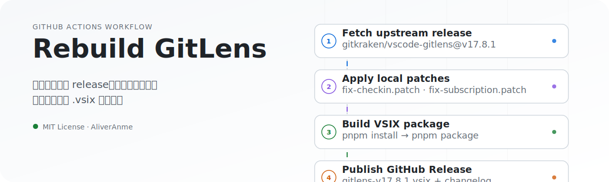

<p align="center">
  
</p>

<h1 align="center">Rebuild GitLens</h1>

<p align="center">用于个人使用及测试的 GitLens 自动构建工作流</p>

---

## 这是什么

一个 GitHub Actions 工作流，自动同步 [gitkraken/vscode-gitlens](https://github.com/gitkraken/vscode-gitlens) 的最新 release，应用 `patches/` 目录下的本地补丁，构建出可直接安装的 `.vsix` 文件，并发布到本仓库的 Releases。

## 工作流

1. **同步上游版本** — 从 `gitkraken/vscode-gitlens` 拉取指定 tag 或最新 release
2. **应用本地补丁** — 自动应用 `patches/*.patch`
3. **构建扩展包** — 执行 `pnpm install` 与 `pnpm package`
4. **发布 Release** — 上传生成的 `.vsix` 与上游 CHANGELOG

## 触发方式

### 手动触发

进入仓库 **Actions → Sync Release**，点击 **Run workflow**：

- 输入版本号（如 `v17.8.1`）可同步指定版本
- 留空则自动获取并同步最新 release

### 定时触发

默认每天 UTC 0:00 自动执行：

```yaml
schedule:
  - cron: '0 0 * * *'
```

## 输入参数

| 参数 | 类型 | 必填 | 默认值 | 说明 |
|------|------|------|--------|------|
| `version` | string | 否 | 最新版本 | 指定 GitLens release 版本号，如 `v17.8.1` |

## 输出产物

- **`.vsix` 安装包**：`gitlens-{version}.vsix`
- **GitHub Release**：包含 `.vsix` 与上游变更日志

## 补丁说明

`patches/` 目录下的补丁会在构建前自动应用：

| 补丁 | 作用 |
|------|------|
| `fix-checkin.patch` | 调整订阅校验返回值 |
| `fix-subscription.patch` | 调整订阅状态计算逻辑 |

## 使用提示

- 输入版本号必须以 `v` 开头
- 若本地已存在对应 tag，工作流会自动跳过，避免重复打包
- 产物仅供个人使用及测试

## 相关链接

- [vscode-gitlens 官方仓库](https://github.com/gitkraken/vscode-gitlens)
- [GitLens 官网](https://www.gitkraken.com/gitlens)

## License

[MIT](./LICENSE)
